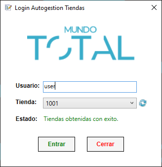
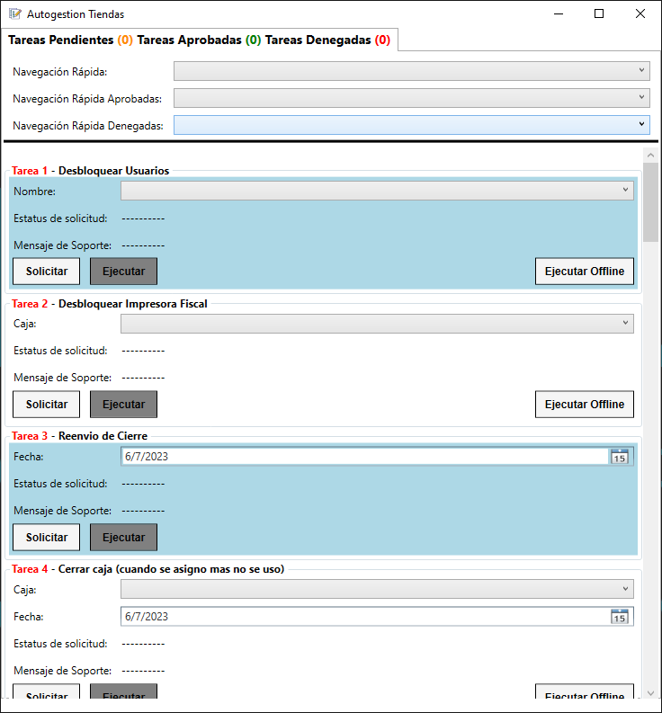
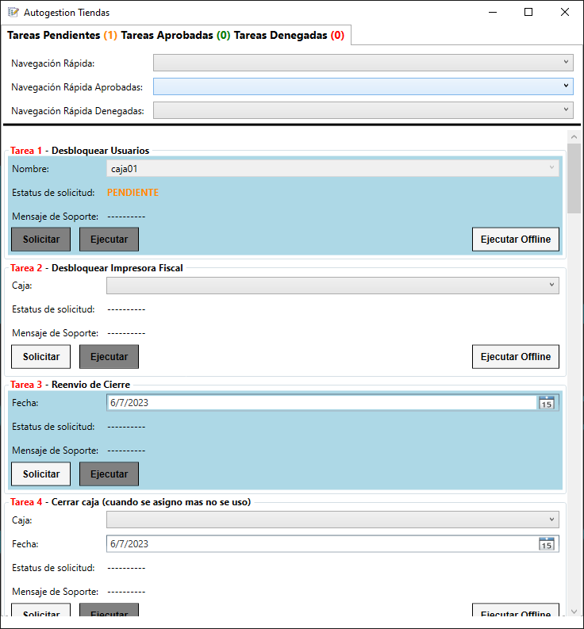
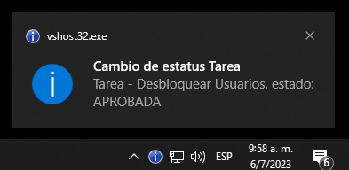
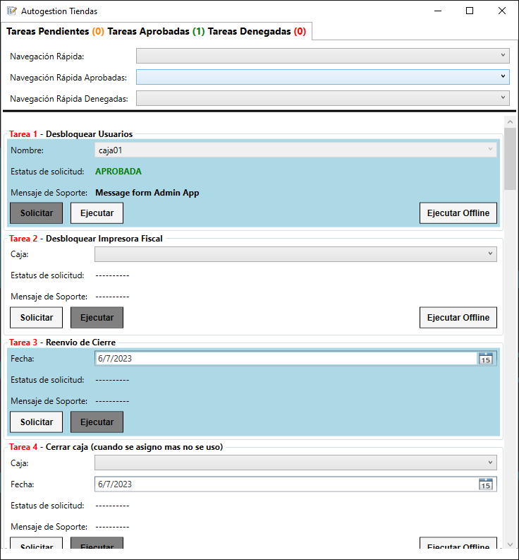

# SelfmanagementStore

This is an application to manage a system of task requests, the requests are sent to an API and the administration software is in charge of approving, denying or closing the task. If the task is approved it can be executed. The application has alerts in case the task status changes, it also has the ability to receive a message from the administration by task status.

[WEB SERVICE APPI](https://github.com/aurquiel/WebApplicationStoreAuto)

[ADMIN APP](https://github.com/aurquiel/WpfApplicationStoreAutoOffice)

---

## Login

## Main

## Pending Task

## Notification Task

## Aprove Task

